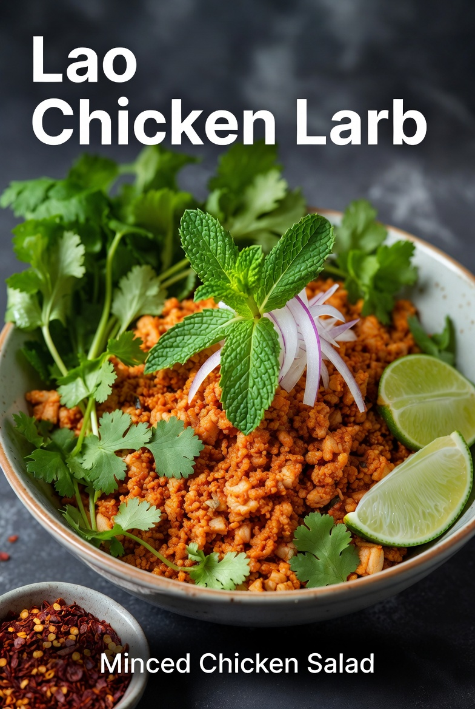
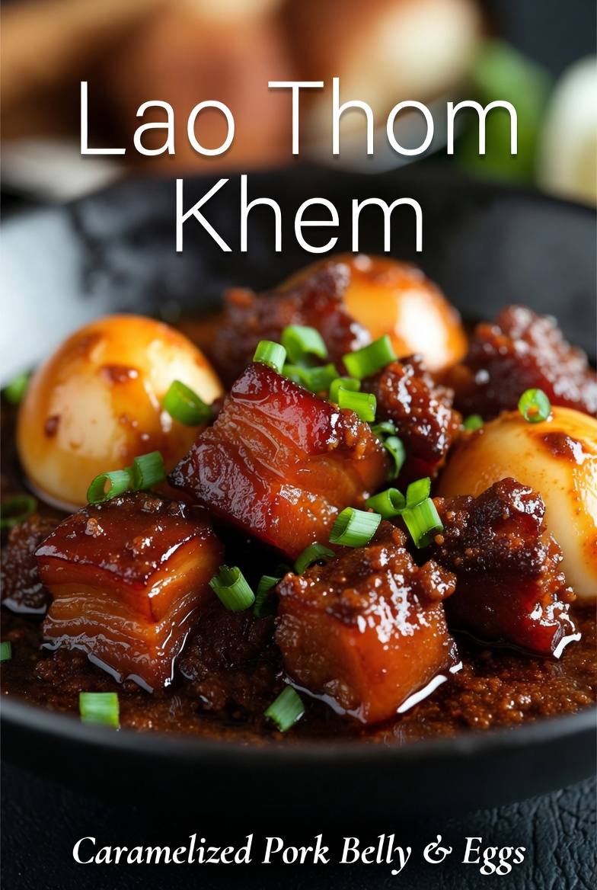

# Examples

Real outputs from the skill — one folder per dish, each with the Instagram front image and the recipe PDF.

| Dish | Front image | Recipe |
|---|---|---|
| Lao Chicken Larb |  | [Lao_Chicken_Larb_Recipe.pdf](chicken-larb/Lao_Chicken_Larb_Recipe.pdf) |
| Lao Thom Khem |  | [Thom_Khem_Recipe.pdf](thom-khem/Thom_Khem_Recipe.pdf) |

Coming next: Tam Mak Houng (green papaya salad). The first run produced a duplicate ingredient line, which is exactly what the verifier layer exists to catch — the regenerated version goes up once it passes.

## Dish names

Lao has no single official Latin spelling, so menus romanize these dishes a dozen ways. The spellings used here, with the Lao script and common variants:

- **Larb** — ລາບ, pronounced "laap" (there is no r sound — the "larb" spelling came into English through Thai via British romanization). Also written laab or laap.
- **Thom Khem** — ຕົ້ມເຄັມ, literally "boiled salty." Also written tom khem.
- **Tam Mak Houng** — ຕຳໝາກຫຸ່ງ, literally "pounded papaya." Also written tam mak hoong or thum mak hoong.
